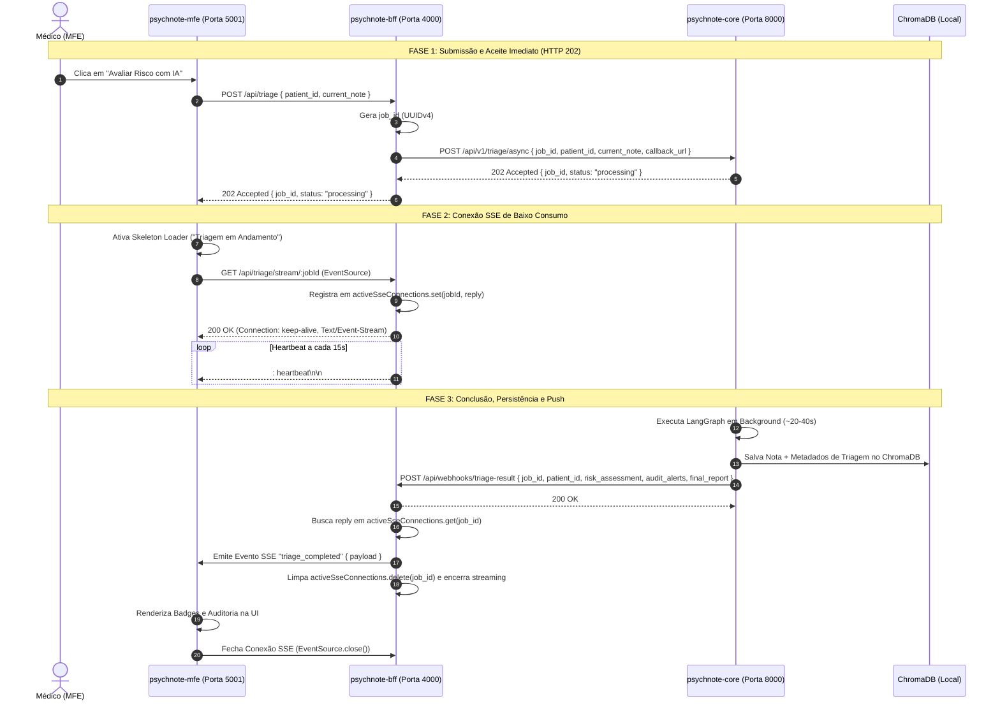

# Visão Geral da Arquitetura — psychnote-bff

## 1. Diagrama de Containers (C4 Level 2)

```
Browser (localhost)
    |
    |  1. HTTP POST /api/triage (Aceite HTTP 202)
    |  2. SSE Stream GET /api/triage/stream/:jobId (EventSource)
    v
psychnote-mfe (React + Vite)       [consumidor]
    localhost:5001 (dev/preview)
    ^
    |  Server-Sent Events (triage_completed)
    |
psychnote-bff (Fastify + Node.js)  [este repositório]
    |                                 ^
    | 1. POST /api/v1/triage/async    | 2. POST /api/webhooks/triage-result
    v                                 |
psychnote-core (FastAPI + LangGraph) [backend de IA]
    |              |
    v              v
  Ollama        ChromaDB
  :11434        ./chroma_db
  llama3:8b     (local persistente)
```

O `psychnote-bff` atua como camada intermediária (Backend for Frontend) orientada a eventos. Suas funções incluem gerenciar o mapa de conexões SSE ativas (`activeSseConnections`), receber notificações via Webhook do `psychnote-core` e retransmitir em tempo real para o `psychnote-mfe`. O BFF não possui banco de dados próprio, não renderiza views HTML e não executa inferência de IA.

---

## 2. Responsabilidades do BFF

- Expor `POST /api/triage` para submissão assíncrona pelo MFE (retorna HTTP 202 com `job_id`).
- Expor `GET /api/triage/stream/:jobId` para abertura de conexão SSE pelo MFE (`EventSource`).
- Gerenciar em memória o mapa de conexões SSE ativas: `activeSseConnections` (`Map<jobId, FastifyReply>`).
- Enviar Heartbeats periódicos (a cada 15s) no canal SSE para impedir timeouts de conexão.
- Expor `POST /api/webhooks/triage-result` para recepção do resultado do `psychnote-core`.
- Repassar o resultado do Webhook para o canal SSE correspondente via evento `triage_completed`.
- Expor `GET /patients` e `GET /patients/:id/record` (histórico) para o MFE.
- Expor `GET /health` para verificação de saúde do serviço.
- Configurar CORS para aceitar origens permitidas (`http://localhost:5001`).
- Configurar HTTP Security Headers via `@fastify/helmet`.
- Validar contratos de entrada e saída com Zod (`fastify-type-provider-zod`).
- Interceptar falhas e garantir execução **crash-free**.
- **NÃO** possui banco de dados, **NÃO** renderiza views, **NÃO** executa inferência de IA.

---

## 3. Stack Tecnológica do BFF

| Camada | Tecnologia | Versão Alvo | Observação |
| :--- | :--- | :--- | :--- |
| Runtime | Node.js | ^20.x LTS | Suporte nativo a `Map`, `AbortController` e SSE |
| Framework HTTP | Fastify | ^5.x | Alta performance, suporte nativo a streaming |
| Validação de Schema | Zod + `fastify-type-provider-zod` | ^3.x / ^3.x | Validação de request, response e webhooks |
| HTTP Client | Undici / fetch nativo | nativo Node.js | Integração assíncrona com o Core |
| Event Streaming | Server-Sent Events (SSE) | HTTP/1.1 standard | Transferência unidirecional Servidor → Cliente |
| Segurança CORS | `@fastify/cors` | latest | Libera exclusivamente `localhost:5001` |
| Segurança HTTP Headers | `@fastify/helmet` | latest | HTTP Security Headers obrigatórios |
| Logging | Pino (nativo do Fastify) | nativo | JSON logging estruturado com `job_id` |

---

## 4. Diagrama de Sequência e Fluxo de Dados Assíncrono (3 Fases)



---

## 5. Restrições e Premissas Inegociáveis

- **Comunicação Assíncrona:** Toda submissão de triagem deve responder HTTP 202 imediatamente. Nenhuma chamada de triagem deve segurar conexões síncronas de longa duração.
- **Gerenciamento Seguro do Mapa de Conexões:** O registro em `activeSseConnections` deve ser estritamente removido após o envio do evento final ou caso o cliente feche a conexão (evento `close` do socket), evitando memory leaks.
- **Separação de responsabilidades de IA:** O BFF não chama o Ollama ou ChromaDB diretamente. Toda a inteligência e persistência vetorial permanecem no Core.
- **Sem persistência de dados clínicos no BFF:** O BFF não persiste notas ou resultados em banco de dados. Os dados em trânsito são mantidos temporariamente apenas nos sockets ativos.
- **Resiliência e Crash-Free:** O processo Node.js do BFF nunca deve encerrar por exceções causadas por desconexões de SSE ou payloads malformados de Webhook.

