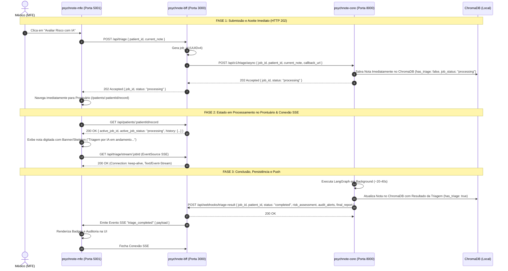

# 📘 Guia de Especificação e Atualização OKF/SDD — psychnote-bff & psychnote-mfe

Este documento serve como a **Especificação Técnica Oficial e Guia de Atualização de Artefatos OKF/SDD e Código** para a transição da plataforma **PsicRE-AI** para a arquitetura **Assíncrona Orientada a Eventos (HTTP 202 + Webhook Callback + SSE Stream + Polling Fallback + Persistência Vetorial no ChromaDB)**.

Qualquer assistente de IA ou desenvolvedor deve utilizar as especificações deste documento ao atuar nos repositórios `psychnote-bff` e `psychnote-mfe`.

---

## 1. Visão Geral da Nova Arquitetura e Contratos



---

## 2. Especificação para o Repositório `psychnote-bff`

### A. Atualizações de Artefatos OKF no `psychnote-bff`
1. **`.okf/index.md`**:
   - Adicionar referências aos novos contratos de Webhook, rotas SSE, consulta de status de job (`GET /api/triage/jobs/:jobId/status`) e ADR de arquitetura assíncrona.
2. **`.okf/architecture/overview.md`**:
   - Atualizar a visão geral para destacar o papel do BFF como gerenciador de canais SSE (`Map<jobId, FastifyReply>`), receptor do Webhook do Core e provedor do status de jobs.
3. **`.okf/decisions/0005-async-webhook-sse-architecture.md` (Novo ADR)**:
   - Registrar a decisão de substituir chamadas síncronas bloqueantes por HTTP 202 + Webhook + SSE + Polling Fallback.
4. **`.okf/contracts/bff-api.md`**:
   - Documentar o contrato de `POST /api/triage` (retorna 202 com `job_id`).
   - Documentar o streaming SSE em `GET /api/triage/stream/:jobId`.
   - Documentar o endpoint de consulta de status `GET /api/triage/jobs/:jobId/status`.
   - Documentar o contrato atualizado de `GET /api/patients/:patientId/record` (incluindo `active_job_id` e `active_job_status`).
5. **`.okf/contracts/core-api.md`**:
   - Documentar as rotas consumidas: `POST /api/v1/triage/async`, `GET /api/v1/triage/jobs/{job_id}` e `GET /api/v1/patients/{id}/history`.
   - Documentar a rota de Webhook exposta `/api/webhooks/triage-result`.

### B. Especificação de Código e Schemas (Zod) no `psychnote-bff`

#### 1. Rota `POST /api/triage`
```typescript
const TriageAsyncRequestSchema = z.object({
  patient_id: z.string().min(1),
  current_note: z.string().min(10),
});

const TriageAsyncResponseSchema = z.object({
  job_id: z.string().uuid(),
  status: z.literal('processing'),
  message: z.string(),
});
```

#### 2. Rota de Status do Job `GET /api/triage/jobs/:jobId/status`
```typescript
const JobStatusResponseSchema = z.object({
  job_id: z.string().uuid(),
  patient_id: z.string(),
  status: z.enum(['processing', 'completed', 'error']),
  created_at: z.string(),
  risk_assessment: z.nullable(z.object({
    risk_level: z.enum(['Baixo', 'Moderado', 'Alto/Iminente']),
    passive_ideation: z.boolean(),
    active_ideation: z.boolean(),
    red_flags: z.array(z.string()),
    protection_factors: z.array(z.string()),
    clinical_justification: z.string(),
  })),
  audit_alerts: z.array(z.string()),
  error_message: z.nullable(z.string()),
});
```

#### 3. Rota SSE `GET /api/triage/stream/:jobId`
- **Headers:** `Content-Type: text/event-stream`, `Cache-Control: no-cache`, `Connection: keep-alive`.
- Armazena o socket de resposta no mapa global `activeSseConnections.set(jobId, reply)`.
- Heartbeat a cada 15s (`: heartbeat\n\n`).

#### 4. Rota Webhook `POST /api/webhooks/triage-result`
- Recebe o resultado do `psychnote-core`:
  ```typescript
  const WebhookPayloadSchema = z.object({
    job_id: z.string().uuid(),
    patient_id: z.string(),
    status: z.enum(['completed', 'error']),
    risk_assessment: z.optional(z.object({ ... })),
    audit_alerts: z.optional(z.array(z.string())),
    final_report: z.optional(z.string()),
  });
  ```
- Localiza `reply = activeSseConnections.get(job_id)`.
- Dispara evento SSE `triage_completed` e fecha o streaming.

---

## 3. Especificação para o Repositório `psychnote-mfe`

### A. Atualizações de Artefatos OKF no `psychnote-mfe`
1. **`.okf/index.md` & `.okf/architecture/overview.md`**:
   - Atualizar a arquitetura de navegação para refletir redirecionamento imediato ao Prontuário (`/patients/:patientId/record`) e consumo de eventos via `EventSource` (SSE).
2. **`.okf/contracts/triage-job-status-spec.md`**:
   - Manter como contrato mestre de UX/UI para status de jobs e prontuário em andamento.

### B. Especificação de Código na UI React

#### 1. Handler de Envio da Nota Clínica (`NewPatientEvolutionView.tsx` / `useTriage.ts`)
```typescript
async function submitClinicalNote(patientId: string, noteText: string) {
  // 1. Envia nota e recebe Job ID
  const response = await fetch('/api/triage', {
    method: 'POST',
    headers: { 'Content-Type': 'application/json' },
    body: JSON.stringify({ patient_id: patientId, current_note: noteText }),
  });
  
  const { job_id } = await response.json();
  
  // 2. Navega imediatamente para o Prontuário do Paciente
  navigate(`/patients/${patientId}/record?activeJobId=${job_id}`);
}
```

#### 2. Renderização do Prontuário (`PatientRecordView.tsx`)
- Ao carregar `/patients/:patientId/record`, se houver `active_job_status === 'processing'` (ou query param `activeJobId`), exibe a evolução com o Banner/Skeleton *"Análise de Risco por IA em andamento..."*.
- Conecta no SSE (`/api/triage/stream/:jobId`). Ao receber `triage_completed`, substitui o Skeleton pelos Badges de Risco e Alertas de Auditoria.

---

## 4. Checklist de Validação nos Projetos

- [x] OKF, ADRs e especificações de status de jobs criadas no `psychnote-core`.
- [x] Endpoint `POST /api/v1/triage/async` pre-registrando nota com `has_triage: false`.
- [x] Endpoint `GET /api/v1/triage/jobs/{job_id}` para consulta de status do job.
- [x] Endpoint `GET /api/v1/patients/{id}/history` servindo histórico em < 50ms.
- [ ] Atualizar OKF, SDD e rotas no `psychnote-bff`.
- [ ] Atualizar OKF, SDD e navegação no `psychnote-mfe`.
