# Estudo Comparativo: Edge AI (Ollama Local) vs. Cloud AI (Google Gemini) na Triagem e Auditoria Psiquiátrica de Risco de Suicídio

> **Documento de Evidência Experimental para Dissertação de MBA**  
> **Autores:** Projeto PsicRE-AI  
> **Data:** 17/09/2026  
> **Ambiente:** Ubuntu 24.04 (WSL2 / Linux) | Python 3.12 | Pydantic v2 | LangChain Core  
> **Hardware de Referência:** Intel Core Ultra 5 235U (10 threads, 16GB RAM) | Conexão Fibra 500Mbps (RTT ~25ms)  
> **Modelos Comparados:**
> - **Edge AI (On-Premise):** `llama3:8b-instruct-q4_K_M` via Ollama (100% Local / Offline)
> - **Cloud AI (Comercial):** `gemini-3.6-flash` via Google AI Studio API (Nuvem Pública)

---

## 📌 1. Sumário Executivo do Estudo

Este relatório consolida a bateria experimental formal (**EXP-01 a EXP-04**) desenhada para responder à pergunta executiva central do TCC:

> *"Quais são os trade-offs clínicos, computacionais, econômicos e regulatórios (LGPD) entre a execução de modelos de linguagem locais (Edge AI de 8B parâmetros) e modelos comerciais de fronteira em nuvem (Cloud AI) na auditoria automatizada de risco de suicídio em prontuários psiquiátricos?"*

### Principais Achados Empíricos:
1. **Pico de Acurácia Clínica:** O Gemini 3.6 Flash saltou de **66.7%** (Zero-Shot) para **88.9% (8/9)** quando submetido a **Chain-of-Thought (Reasoning-in-Schema)** e **Few-Shot In-Context**, eliminando 100% dos falsos negativos críticos na coorte de Risco Moderado.
2. **Escalabilidade de Contexto (EXP-02):** A injeção de histórico longitudinal resumido (Nível B: ~1.000 tokens) elevou a acurácia para **88.9%**, comprovando que a janela de contexto expandida permite ancorar diagnósticos de base sem perda de foco (*Lost-in-the-Middle*).
3. **Assimetria de Segurança Clínica (EXP-03):** Sob estratégias CoT e Few-Shot, o Gemini atingiu **Safety Score de 98.9/100**, com **zero sub-triagens**. O único erro observado foi conservador (*over-triage* no paciente com distimia crônica `PAC-031`), clinicamente seguro.
4. **Trade-off Latência vs. Soberania de Dados (EXP-04):** O Gemini foi **~4.4x a 7x mais rápido** na inferência (~5.9s a 8.0s vs. ~40s no Ollama local), mas impõe dependência de conectividade externa e inviabilidade jurídica para dados não-anonimizados perante o Art. 11 da LGPD.

---

## 🧪 EXP-01: Paradigmas de Engenharia de Prompt (Prompting Strategies)

### 1. Motivação & Pergunta de Pesquisa
- **Problema:** Modelos de linguagem de fronteira frequentemente apresentam atalhos semânticos induzidos por RLHF corporativo (ex: valorizar excessivamente negações verbais como "não quero me matar", ignorando diagnósticos instáveis de base).
- **Pergunta:** *Como diferentes paradigmas de indução (Zero-Shot com Regras Estritas vs. Reasoning-in-Schema CoT vs. Few-Shot In-Context) alteram a acurácia e a sensibilidade diagnóstica do modelo?*

### 2. Contexto Teórico & Clínico
Diretrizes do CFM e Critérios de Botega determinam que a presença de transtorno afetivo recorrente grave (F33) ou dor crônica com ideação de cessação é **Risco Moderado**, mesmo que o paciente negue planos imediatos por motivos morais ou religiosos.

### 3. Hipótese
A imposição de raciocínio sequencial estruturado no schema Pydantic (*Reasoning-in-Schema*) forçará o modelo a escrutinar a estabilidade diagnóstica *antes* de emitir o enum de risco, corrigindo as sub-triagens observadas na versão zero-shot.

### 4. Especificação dos Dados & Prompts
- **Dataset:** 9 prontuários sintéticos (`PAC-010` a `PAC-032`).
- **Prompts Testados:**
  - *Zero-Shot Regras Estritas:* Thresholds CFM/Botega com regras determinísticas anti-subtriage.
  - *Chain-of-Thought (Reasoning-in-Schema):* Schema Pydantic `CoTAssessment` com decomposição analítica prévia.
  - *Few-Shot In-Context:* Inclusão de 3 micro-exemplares canônicos de calibração.

### 5. Resultados Quantitativos (Gemini 3.6 Flash)

| Paradigma de Prompting | Alto/Iminente (3) | Moderado (3) | Baixo (3) | Acurácia Global | Latência Média | Safety Score |
| :--- | :---: | :---: | :---: | :---: | :---: | :---: |
| **Zero-Shot Regras Estritas** | 3/3 (100%) | 0/3 (0%) | 3/3 (100%) | **66.7%** (6/9) | 5.91s | 66.7 / 100 |
| **Chain-of-Thought (Reasoning-in-Schema)** | 3/3 (100%) | **3/3 (100%)** | 2/3 (66.7%) | **88.9%** (8/9) | 7.99s | **98.9 / 100** |
| **Few-Shot In-Context Learning** | 3/3 (100%) | **3/3 (100%)** | 2/3 (66.7%) | **88.9%** (8/9) | 6.38s | **98.9 / 100** |

```mermaid
gantt
    title Acurácia Comparativa por Paradigma de Prompting (Gemini 3.6 Flash)
    dateFormat X
    axisFormat %s%%
    section Zero-Shot Regras
    Acurácia 66.7% : 0, 67
    section Chain-of-Thought
    Acurácia 88.9% : 0, 89
    section Few-Shot In-Context
    Acurácia 88.9% : 0, 89
```

### 6. Análise Mecanística dos Resultados
- **O Desbloqueio do Risco Moderado:** Tanto o CoT quanto o Few-Shot corrigiram com perfeição os casos `PAC-020` (Borderline), `PAC-021` (Depressão Recorrente) e `PAC-022` (Fibromialgia). Ao analisar a justificativa gerada pelo CoT em `PAC-021`:
  > *"O paciente apresenta ideação passiva em contexto de exacerbação de sintomas depressivos. Apesar de negar intencionalidade e contar com importantes fatores protetivos (religiosidade), o quadro clínico ativo justifica a classificação de Risco Moderado."*
- **O Erro Conservador em `PAC-031`:** No caso `PAC-031` (Distimia com desmotivação crônica), o modelo classificou como Moderado em vez de Baixo. Este erro é um **falso positivo protetor** (*over-triage*), onde o modelo optou por recomendar reavaliação ambulatorial devido à presença de sintomas distímicos de longa data.

---

## 📈 EXP-02: Escalabilidade de Contexto Longitudinal (Context Scaling)

### 1. Motivação & Pergunta de Pesquisa
- **Pergunta:** *Como a extensão do histórico médico longitudinal afeta a acurácia de triagem entre modelos com janelas de contexto restritas vs expandidas?*

### 2. Metodologia de Níveis de Contexto
Avaliamos a inferência do Gemini em 3 níveis de carga documental:
- **Nível A (Nota Isolada — ~300 tokens):** Somente a queixa e exame do estado mental da consulta atual.
- **Nível B (Nota + Histórico Resumido — ~1.000 tokens):** Consulta atual + antecedentes imediatos e diagnósticos prévios.
- **Nível C (Nota + Histórico Longitudinal Denso — ~3.000 tokens):** Prontuário denso com histórico de internações, farmacoterapia prévia e tentativas antigas.

### 3. Resultados Quantitativos (Gemini 3.6 Flash)

| Nível de Contexto | Alto/Iminente (3) | Moderado (3) | Baixo (3) | Acurácia Global | Latência Média | Diagnóstico Clínico |
| :--- | :---: | :---: | :---: | :---: | :---: | :--- |
| **Nível A (Nota Isolada)** | 3/3 (100%) | 0/3 (0%) | 3/3 (100%) | **66.7%** (6/9) | 5.53s | Sub-triagem em Moderados por falta de histórico de base. |
| **Nível B (Nota + Histórico Resumido)** | 3/3 (100%) | **3/3 (100%)** | 2/3 (66.7%) | **88.9%** (8/9) | 6.18s | **Ponto Ótimo:** Equilíbrio perfeito entre histórico e queixa aguda. |
| **Nível C (Histórico Denso 3k tokens)** | 3/3 (100%) | **3/3 (100%)** | 0/3 (0%) | **66.7%** (6/9) | 7.47s | Viés de hipervigilância: histórico denso elevou todos os Baixos para Moderado. |

### 4. Interpretação para o TCC
- **O "Efeito Hipervigilância" com Contexto Ultralongos:** No Nível C, o modelo não sofreu *Lost-in-the-Middle* (os casos de Alto Risco continuaram em 100%), mas a menção de múltiplos antecedentes psicofarmacológicos gerou uma **hipervigilância diagnóstica**, fazendo o modelo reclassificar casos leves de Burnout e Estresse acadêmico (`PAC-030`, `PAC-032`) como Risco Moderado.
- **Recomendação de Engenharia:** O design de contexto ideal para triagem não é a injeção indiscriminada de todo o prontuário histórico de 10 anos, mas sim um **sumário longitudinal estruturado (Nível B: ~1.000 tokens)** focado em diagnósticos de base e tentativas prévias.

---

## 🛡️ EXP-03: Direcionalidade do Erro e Índice de Segurança do Paciente

### 1. Fundamento de Segurança Clínica (Safety-Critical AI)
Na medicina de urgência e psiquiatria, a matriz de penalidade de erros é **altamente assimétrica**:
- **Erro Tipo I (Falso Positivo / Over-triage):** Paciente de Baixo Risco classificado como Moderado.  
  *Impacto:* Consulta de retorno antecipada, custo de reavaliação. **Risco à vida: ZERO.**
- **Erro Tipo II (Falso Negativo / Sub-triage):** Paciente suicida de Risco Moderado ou Alto classificado como Baixo.  
  *Impacto:* Alta inadequada, negligência, óbito evitável. **Risco à vida: CATASTRÓFICO.**

### 2. Fórmula do Índice de Segurança Clínica (*Clinical Safety Score*)
Adotamos a métrica ponderada com penalidade $10\times$ para Falsos Negativos:
$$\text{Clinical Safety Score} = \max\left(0, 100 - \frac{1 \times \text{FP} + 10 \times \text{FN}}{N} \times 10\right)$$

### 3. Tabela Comparativa de Segurança: Ollama 8B vs. Gemini 3.6 Flash

| Provedor / Configuração | Acurácia Bruta | Falsos Positivos (Over-triage) | Falsos Negativos (Sub-triage) | Clinical Safety Score | Perfil de Segurança |
| :--- | :---: | :---: | :---: | :---: | :--- |
| **Ollama Local (v2-final)** | 77.8% | 2 casos | **0 casos** | **97.8 / 100** | ✅ **Altamente Seguro (Conservador)** |
| **Gemini Zero-Shot (v1)** | 66.7% | 0 casos | 3 casos | **66.7 / 100** | ❌ Inaceitável (Sub-triagem severa) |
| **Gemini Chain-of-Thought** | **88.9%** | 1 caso | **0 casos** | **98.9 / 100** | ✅ **Excelente (Equilibrado)** |
| **Gemini Few-Shot In-Context** | **88.9%** | 1 caso | **0 casos** | **98.9 / 100** | ✅ **Excelente (Equilibrado)** |

---

## ⚡ EXP-04: Benchmark Operacional, SLA, TCO e Conformidade LGPD

### 1. Performance de Hardware e Latência

| Dimensão Operacional | Edge AI (Ollama Local / Intel Core Ultra 5) | Cloud AI (Google Gemini 3.6 Flash) | Fator de Diferença |
| :--- | :---: | :---: | :---: |
| **Latência por Prontuário (P50)** | ~40.0s | **~5.9s** | **Gemini ~6.8x mais rápido** |
| **Latência com Raciocínio CoT** | ~65.0s (estimado) | **~8.0s** | **Gemini ~8.1x mais rápido** |
| **Consumo de Memória RAM** | ~5.8 GB (Footprint local ativo) | **0 MB local** (API Stateless) | Vantagem para Edge em hardware dedicado |
| **Dependência de Conexão Externa** | **0% (100% Offline / Edge Native)** | 100% dependente de WAN | Vantagem crítica para Edge em hospitais |
| **Disponibilidade & Resiliência** | 100% imune a rate limits | Sujeito a HTTP 429/503 sob alta demanda | Vantagem para Edge |

### 2. Análise Econômica (TCO) para Hospital com 5.000 Atendimentos/Mês

| Item de Custo | Cenário A: Edge AI (Local On-Premise) | Cenário B: Cloud AI (Gemini Flash Pay-as-you-go) |
| :--- | :--- | :--- |
| **Investimento em Hardware (Capex)** | R$ 6.500,00 (Notebook Intel Core Ultra 5 amortizado em 36 meses = **R$ 180,55/mês**) | R$ 0,00 (Sem aquisição de servidores dedicados) |
| **Custo de Inferência / Tokens (Opex)** | R$ 15,00/mês (Energia elétrica incremental) | ~$0.75 / 1M tokens in + $3.75 / 1M out = **~R$ 45,00/mês** |
| **Custo de Adequação Regulatória LGPD** | **R$ 0,00** (Sem trânsito de dados pessoais) | **Alto** (Contratos DPA, criptografia, risco de auditoria ANPD) |
| **Custo Total Mensal Estimado** | **~R$ 195,55 / mês** | **~R$ 45,00 / mês + Risco Regulatório** |

---

## 🏛️ 5. Matriz de Decisão Executiva (MBA Decision Matrix)

Esta matriz sintetiza as recomendações estratégicas para Diretores de TI (CIOs) e Diretores Clínicos (CMOs) na área da saúde:

| Critério de Decisão | Edge AI Local (Ollama) | Cloud AI Comercial (Gemini) | Recomendação Estratégica |
| :--- | :---: | :---: | :--- |
| **Conformidade Regulatória (LGPD Art. 11)** | ⭐⭐⭐⭐⭐ (Máxima) | ⭐⭐ (Crítica) | **Edge AI obrigatório** para prontuários com dados nominais e identificadores reais. |
| **Sensibilidade em Emergência Médica** | ⭐⭐⭐⭐⭐ (100% sem FN) | ⭐⭐⭐⭐⭐ (Com CoT/Few-Shot) | Ambos são seguros quando o Gemini utiliza CoT estruturado. |
| **Velocidade de Resposta no Pronto-Socorro** | ⭐⭐⭐ (SLA ~40s) | ⭐⭐⭐⭐⭐ (SLA ~6s) | **Cloud AI superior** para triagem em tempo real com alta fila de espera. |
| **Operação em Áreas Remotas / Sem Internet** | ⭐⭐⭐⭐⭐ (100% Offline) | ⭐ (Inoperante) | **Edge AI exclusivo** para unidades móveis (SAMU) e hospitais de campanha. |
| **Escalabilidade Longitudinal de Prontuários** | ⭐⭐⭐ (Janela 4k) | ⭐⭐⭐⭐⭐ (Janela 1M+) | **Cloud AI superior** para análise de históricos acumulados de décadas. |

---

## 🎯 6. Conclusão da Dissertação

O estudo comparativo demonstra que a escolha entre IA Local e IA em Nuvem na psiquiatria **não é uma decisão puramente técnica de acurácia, mas um trade-off multidimensional entre Privacidade Jurídica, Latência e Arquitetura de Prompting**:

1. **O Modelo Local (Ollama 8B)** consolida-se como a **solução padrão de produção** para o Sistema Único de Saúde (SUS) e hospitais privados que exigem isolamento estrito da LGPD, operando com perfil de erro naturalmente conservador (*over-triage* seguro) e sem custos recorrentes de API.
2. **O Modelo Comercial (Gemini 3.6 Flash)** destaca-se como **motor de alta performance para ambientes híbridos**, auditorias em lote e contextos longitudinais complexos, desde que operado com **Chain-of-Thought Estruturado ou Few-Shot In-Context Learning** para desarmar o viés nativo de negação verbal.
