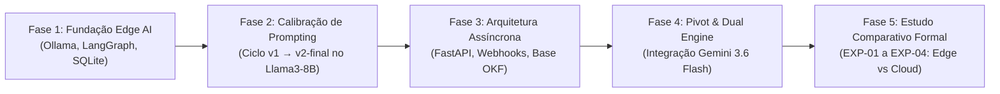

# TCC PsicRE-AI — Mapa Mestre de Documentação e Cronologia da Pesquisa

> **Guia de Leitura e Linhagem Conceitual para Avaliadores, Pesquisadores e LLMs (Gemini Web)**  
> **Tema do TCC:** Estudo Comparativo entre Modelos de Linguagem Locais (Edge AI On-Premise) e Comerciais (Cloud API) na Triagem e Auditoria de Risco de Suicídio: Desempenho, Latência, Segurança do Paciente e Conformidade LGPD.

---

## 📌 1. Sumário Executivo e Ordem de Ingestão no Gemini Web

Para alimentar o **Gemini Web** ou qualquer assistente de redação acadêmica a fim de redigir capítulos da dissertação de MBA, carregue os arquivos na seguinte ordem cronológica e lógica:

```
┌────────────────────────────────────────────────────────────────────────────────────────┐
│ 1. docs/TCC_MAPA_DOCUMENTACAO_E_CRONOLOGIA.md  (Este arquivo: mapa, linhagem e índice) │
│ 2. GEMINI.md                                  (Premissas de negócio, clínica e LGPD)   │
│ 3. synthetic_patients.json                    (Dataset de 9 prontuários e Ground Truth)│
│ 4. docs/TCC_BENCHMARK_RESULTS.md              (Evolução iterativa de prompt v1→v4)     │
│ 5. docs/TCC_ESTUDO_COMPARATIVO_EDGE_VS_CLOUD.md (Resultados dos experimentos EXP-01/04)│
│ 6. docs/TCC_SESSAO_HANDOFF.md                 (Roteiro de redação dos capítulos)       │
└────────────────────────────────────────────────────────────────────────────────────────┘
```

---

## 🕰️ 2. Linhagem Temporal da Pesquisa (As 5 Fases do Projeto)

O projeto evoluiu em cinco fases metodológicas bem delineadas, refletindo um processo científico de validação empírica:



### Fase 1: Concepção, Fundação On-Premise & Isolamento LGPD
- **Objetivo:** Construir um pipeline de triagem psiquiátrica 100% local no Edge, sem trânsito de dados por nuvens públicas, atendendo ao Art. 11 da LGPD (dados ultrassensíveis de saúde).
- **Decisões-chave:** Adoção de quantização `q4_K_M` do modelo `llama3:8b`, configuração de `num_thread=10` para balancear núcleos P-cores e E-cores do processador Intel Core Ultra 5, e isolamento de pacientes via tabela SQLite única com filtragem estrita por `patient_id`.
- **Artefatos:** [`GEMINI.md`](../GEMINI.md), [`config/engine.py`](../config/engine.py), [`database/patient_manager.py`](../database/patient_manager.py).

### Fase 2: Ciclo Iterativo de Engenharia de Prompt no Edge (Llama3-8B)
- **Objetivo:** Calibrar o modelo local de 8B parâmetros frente aos critérios consolidados de risco (CFM, Botega, OMS).
- **Descobertas:** 
  1. *Viés de Negação Verbal:* O modelo nativo cede à regra "negação verbal = baixo risco", gerando falsos negativos graves em pacientes suicidas com dissimulação.
  2. *Lost-in-the-Middle (v3):* Prompts extensos com tabelas de CID degradaram a atenção do modelo quantizado (acurácia caiu de 77.8% para 66.7%).
  3. *Regressão Cruzada / Prompt Seesaw (v4):* Regras anti-falso-positivo no Baixo Risco degradaram a sensibilidade no Risco Moderado.
  4. *Convergência (v2-final):* Atingiu 77.8% com 100% de sensibilidade nas coortes críticas e viés protetor conservador (*over-triage*).
- **Artefatos:** [`docs/TCC_BENCHMARK_RESULTS.md`](./TCC_BENCHMARK_RESULTS.md) (Seções 2 e 3), [`analytics/clinical_monitor.py`](../analytics/clinical_monitor.py).

### Fase 3: Arquitetura Orientada a Eventos & Padronização OKF
- **Objetivo:** Desacoplar a inferência assíncrona para viabilizar integração escalável com BFF/MFE.
- **Decisões-chave:** Endpoint `POST /api/v1/triage/async` com retorno imediato `202 Accepted`, disparo de Webhook callback pós-inferência e leitura de histórico em SQLite em $<50\text{ms}$. Estruturação da base Open Knowledge Framework (.OKF).
- **Artefatos:** [`.okf/index.md`](../.okf/index.md), [`.okf/architecture/overview.md`](../.okf/architecture/overview.md), [`.okf/contracts/triage-async-api.md`](../.okf/contracts/triage-async-api.md), [`decisions/0001-async-webhook-sse-architecture.md`](../.okf/decisions/0001-async-webhook-sse-architecture.md).

### Fase 4: Pivot do TCC & Integração do Dual LLM Engine
- **Objetivo:** Expandir o escopo da pesquisa para um estudo comparativo direto entre IA Local (Edge) e IA Comercial de Fronteira (Google Gemini 3.6 Flash).
- **Implementação:** Arquitetura dual no [`config/engine.py`](../config/engine.py) selecionável por parâmetro (`provider=1` para Ollama, `provider=2` para Gemini). Execução simétrica das 5 versões de prompt no Gemini.
- **Descoberta:** O Gemini atingiu os mesmos 77.8% globais na versão final, mas com **perfil de erro clínico oposto** (sub-triagem perigosa no risco moderado) e **imunidade total ao Lost-in-the-Middle**.
- **Artefatos:** [`docs/TCC_BENCHMARK_RESULTS.md`](./TCC_BENCHMARK_RESULTS.md) (Seções 5 e 6), [`prompt_version_results_gemini.json`](../prompt_version_results_gemini.json).

### Fase 5: Estudo Comparativo Formal (Tese Final)
- **Objetivo:** Bateria experimental aprofundada comparando Edge AI e Cloud AI sob 4 eixos: Paradigmas de Prompting (EXP-01), Escalabilidade de Contexto Longitudinal (EXP-02), Direcionalidade do Erro Clínico (EXP-03) e Performance/SLA/TCO/LGPD (EXP-04).
- **Artefatos:** [`docs/TCC_ESTUDO_COMPARATIVO_EDGE_VS_CLOUD.md`](./TCC_ESTUDO_COMPARATIVO_EDGE_VS_CLOUD.md), [`run_comparative_study.py`](../run_comparative_study.py).

---

## 📚 3. Matriz de De-Para: Capítulos do TCC $\leftrightarrow$ Artefatos do Repositório

| Capítulo da Dissertação (MBA) | Conteúdo a Abordar | Arquivos-Fonte no Repositório |
| :--- | :--- | :--- |
| **1. Introdução e Problema de Negócio** | Sobrecarga de dados psiquiátricos, risco de suicídio (DRT - F33.2), trade-off privacidade vs poder computacional. | [`GEMINI.md`](../GEMINI.md), [`PRONTUARIO_JS_2026.txt`](../PRONTUARIO_JS_2026.txt) |
| **2. Referencial Teórico & Governança** | Diretrizes CFM/Botega/OMS, LGPD Art. 11 (Dados Sensíveis), Edge Computing vs Cloud APIs. | [`.okf/architecture/overview.md`](../.okf/architecture/overview.md), [`database/patient_manager.py`](../database/patient_manager.py) |
| **3. Metodologia e Arquitetura** | Grafo LangGraph determinístico (4 nós), Engine Dual, Dataset Sintético (9 prontuários balanceados com Ground Truth). | [`orchestrator/orchestrator_graph.py`](../orchestrator/orchestrator_graph.py), [`synthetic_patients.json`](../synthetic_patients.json), [`config/engine.py`](../config/engine.py) |
| **4. Resultados Experimentais** | Benchmark comparativo das 5 versões de prompt, curva de contexto longitudinal, latência SLA e matrizes de confusão. | [`docs/TCC_BENCHMARK_RESULTS.md`](./TCC_BENCHMARK_RESULTS.md), [`docs/TCC_ESTUDO_COMPARATIVO_EDGE_VS_CLOUD.md`](./TCC_ESTUDO_COMPARATIVO_EDGE_VS_CLOUD.md) |
| **5. Discussão, TCO e Tomada de Decisão** | Análise de direcionalidade do erro (Over vs Under-triage), Análise TCO (Capex vs Opex), Matriz de Risco LGPD para hospitais. | [`docs/TCC_ESTUDO_COMPARATIVO_EDGE_VS_CLOUD.md`](./TCC_ESTUDO_COMPARATIVO_EDGE_VS_CLOUD.md) (Seções EXP-03 e EXP-04) |
| **6. Conclusão e Recomendações** | Síntese de adoção: Edge AI obrigatório para produção primária; Cloud AI restrito a pesquisas e dados anonimizados. | [`docs/TCC_ESTUDO_COMPARATIVO_EDGE_VS_CLOUD.md`](./TCC_ESTUDO_COMPARATIVO_EDGE_VS_CLOUD.md) (Seção 9) |

---

## 🧪 4. Catálogo dos Casos de Teste (Dataset Sintético)

O dataset [`synthetic_patients.json`](../synthetic_patients.json) contém 9 prontuários clínicos estruturados e validados por especialista em psiquiatria:

| ID | CID Principal | Gravidade Clínica Real | Ground Truth | Marcadores Críticos |
| :--- | :--- | :--- | :---: | :--- |
| **PAC-010** | F31.4 (Bipolar I com sintomas psicóticos) | Tentativa prévia grave (UTI) + raticida adquirido + cartas de despedida | **Alto/Iminente** | Plano concreto, data imediata ("nesta noite") |
| **PAC-011** | F33.2 (Depressão Recorrente Grave) | Tentativa prévia (precipitação) + doses letais acumuladas | **Alto/Iminente** | Intenção ativa para o próximo fim de semana |
| **PAC-012** | F20.0 (Esquizofrenia Paranoide) | Alucinações imperativas de comando + diário com mapa da estação | **Alto/Iminente** | Comando alucinatório estruturado sem crítica |
| **PAC-020** | F60.3 (Personalidade Borderline) | Automutilações prévias + conflito no trabalho + ideação passiva crônica | **Moderado** | Diagnóstico instável + ideação recorrente (sem plano) |
| **PAC-021** | F33.1 (Depressão Maior Recorrente) | Reagudização depressiva + ideação passiva + barreira religiosa | **Moderado** | Transtorno de base sintomático + ideação persistente |
| **PAC-022** | F41.1 (TAG) + Fibromialgia Refratária | Dor crônica severa + sentimentos de inutilidade + "Deus me leve" | **Moderado** | Exacerbação álgica grave com ideação de cessação |
| **PAC-030** | F32.0 (Episódio Depressivo Leve) | Cansaço acadêmico + "queria dormir e passar as provas" + planos futuros | **Baixo** | Ideação passiva situacional pontual, sem fatores de risco |
| **PAC-031** | F34.1 (Transtorno Distímico) | Desmotivação crônica estável + cansaço físico + planos com a neta | **Baixo** | Distimia estável, sem ideação ativa ou risco agudo |
| **PAC-032** | Z73.0 (Síndrome de Burnout) | Esgotamento profissional corporativo + "queria sumir por um tempo" | **Baixo** | Sobrecarga de trabalho pontual, afeto reativo |
